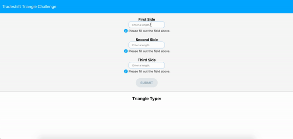

# Tradeshift Triangle Challenge

[Live Link](https://jesusmontano.github.io/tradeshift-challenge/)

## How to Run the Application

From the project directory, run the following:

* `npm install`
* `npm start` to run the app in development mode. You can open [http://localhost:3000](http://localhost:3000) to view it in the browser.

## How to Run Tests

From the project directory, run the following:

* `npm test` to launch the test runner.

## Discussion

This project was bootstrapped with [`create-react-app`](https://github.com/facebook/create-react-app). 
I chose to use `create-react-app` because it provides a built-in testing 
environment and a ready-made application starter, allowing me to start building 
the application without having to deal with Webpack and Babel configurations.

I used [`Tradeshift Elements`](https://github.com/Tradeshift/elements) to help build 
this application's user interface. `Tradeshift Elements` allowed me to integrate 
reusable Tradeshift UI components into the application, giving it styling that 
is consistent with the Tradeshift platform.

The code for the main component of the application, the form, can be found in 
App.js. In this component, the submit button is enabled or disabled depending on
whether the input values are valid numbers greater than zero. If users input 
charcters that are not numeric characters, the appropriate feedback is rendered.
This is done with the help of the `determineFeedback` function. Once all input
values are valid, the submit button is enabled. When submitted, the `handleSubmit`
function is invoked which uses the `determineType` function in `util/helpers.js`
to determine what type of triangle the three sides form. In the event that
the three lengths don't form a triangle, the appropriate error message is rendered.

Referred to in the previous paragraph, there is a seperate file, `helpers.js`, 
that contains functions responsible for detemining whether three sides can form 
a triangle, what type of triangle three sides form, and whether all 
input side lengths are greater than zero.

